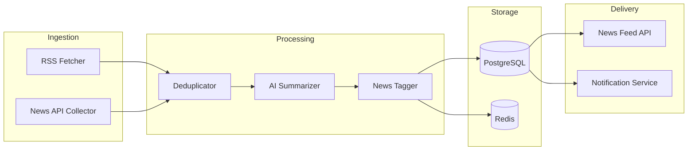
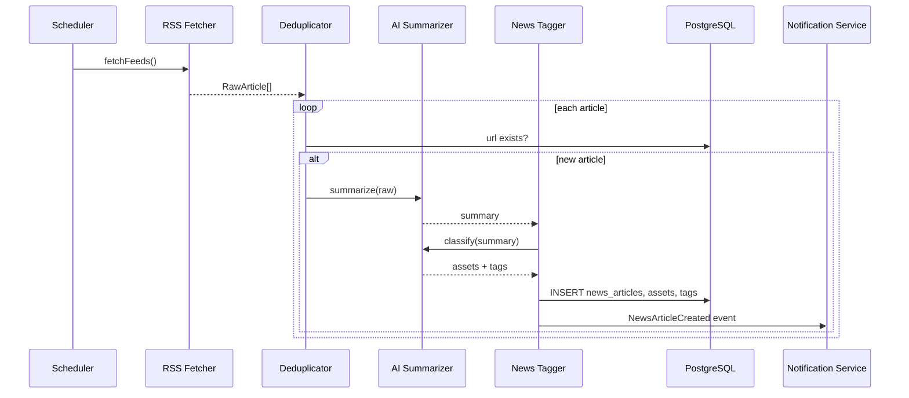

# News + AI Pipeline Architecture

Automated pipeline: fetch news → deduplicate → summarize → tag assets → store → notify users.

## Overview



## Components

### 1. RSS Fetcher

| Property | Value |
|----------|-------|
| Trigger | Cron every 15 minutes (`@Scheduled`) |
| Sources | Configurable feed list in `application.yml` |
| Output | Raw articles: `{url, title, rawContent, publishedAt, source}` |

**Initial RSS sources (examples):**

| Source | Feed | Assets covered |
|--------|------|----------------|
| CoinDesk | RSS | BTC, ETH, crypto |
| Reuters Markets | RSS | Stocks, commodities, macro |
| Yahoo Finance | RSS | US equities |

**Rules:**
- Respect `robots.txt` and rate limits (max 1 req/sec per domain)
- Store fetch cursor (last seen GUID/URL) in Redis to avoid re-processing

### 2. News Collector (optional API layer)

Supplements RSS with structured APIs when licensed:

| Provider | Use case |
|----------|----------|
| NewsAPI.org | Broad headline search by keyword |
| Alpha Vantage News | Equity-specific sentiment |
| CryptoCompare | Crypto news |

Collector normalizes all inputs to the same internal `RawArticle` DTO before dedup.

### 3. Deduplicator

```
Input:  RawArticle
Check:  SELECT 1 FROM news_articles WHERE url = :url
Action: Skip if exists; else proceed
```

Secondary fuzzy match (optional): same title + same source within 1 hour → skip.

### 4. AI Summarizer

| Property | Value |
|----------|-------|
| Model | OpenAI GPT-4o-mini (configurable) |
| Input | `{title, rawContent, source, publicationDate}` |
| Output | `{summary, keyPoints[]}` |

**Prompt constraints (enforced in system prompt):**

1. Summary ≤ 150 words
2. Must include source name and publication date in output metadata
3. No investment advice, no price predictions
4. State uncertainty when facts are unverified
5. Respond in the user's locale if specified (default: English)

**Quality gate:** Reject and log if summary exceeds 150 words or missing source/date. See [AI KPIs](../ai/AI_KPI.md).

### 5. News Tagger

Maps articles to assets and topic tags.

```
Input:  {title, summary, rawContent}
Output: {
  assets: [{symbol, confidence}],
  tags: [{tag, confidence}]    // e.g. "earnings", "regulation"
}
```

**Tagging strategy:**

1. **Keyword match** — symbol/name lookup against Asset Master (fast path)
2. **AI classification** — LLM returns asset symbols + topic tags with confidence ≥ 0.7
3. **Persist** — `news_article_assets` + `news_tags` tables

Example: Article mentioning "Bitcoin ETF approval" → assets: `[BTC]`, tags: `[regulation, etf]`.

### 6. News Storage

```sql
INSERT INTO news_articles (source, publication_date, title, url, summary)
INSERT INTO news_article_assets (news_article_id, asset_id)  -- for each matched asset
INSERT INTO news_tags (news_article_id, tag, confidence)     -- for each tag
```

After insert:
- Invalidate Redis cache keys: `news:feed:*`, `news:asset:{symbol}:*`
- Emit domain event: `NewsArticleCreated` → Notification Service

## Sequence Diagram



## Backend Package Structure

```
com.acme.investment
├── application/news
│   ├── FetchNewsUseCase
│   ├── SummarizeArticleUseCase
│   └── TagArticleUseCase
├── infrastructure/news
│   ├── RssFeedClient
│   ├── NewsApiClient
│   ├── OpenAiSummarizer
│   └── OpenAiTagger
└── interfaces/scheduler
    └── NewsIngestionScheduler
```

## Configuration

```yaml
news:
  ingestion:
    cron: "0 */15 * * * *"
    max-articles-per-run: 50
  rss:
    feeds:
      - url: https://www.coindesk.com/arc/outboundfeeds/rss/
        source: CoinDesk
      - url: https://feeds.reuters.com/reuters/businessNews
        source: Reuters
  ai:
    summarizer-model: gpt-4o-mini
    tagger-model: gpt-4o-mini
    max-summary-words: 150
```

## Failure Handling

| Failure | Action |
|---------|--------|
| RSS timeout | Log warning, skip feed, retry next cron |
| AI rate limit | Queue article in Redis `news:pending`, retry with backoff |
| AI bad output (KPI fail) | Store raw only, mark `summary = NULL`, alert ops |
| Duplicate URL | Skip silently |

## AI Portfolio Analysis (separate flow)

Distinct from news pipeline but shares citation rules:

```
POST /api/v1/portfolios/{id}/analysis
  → Load holdings + recent news for portfolio assets
  → Prompt LLM with portfolio snapshot + news context
  → Persist ai_portfolio_analyses + ai_analysis_citations
  → Return analysis with risk_score and citations
```

Multi-turn chat (planned):

```
POST /api/v1/ai/conversations
POST /api/v1/ai/conversations/{id}/messages
  → Persist ai_conversations + ai_messages
  → Include portfolio context + recent news in prompt window
```

## Security & Compliance

- Outbound AI calls only through approved provider (OpenAI API key in env)
- No user PII sent to LLM beyond portfolio symbols and amounts
- All AI outputs stored for audit; moderators can flag via admin API
- Disclaimer shown in UI: "AI-generated summary, not financial advice"

## Monitoring

| Metric | Alert threshold |
|--------|-----------------|
| `news.ingestion.articles_processed` | < 1 per hour during market hours |
| `news.ai.summarizer.latency_p95` | > 10s |
| `news.ai.kpi_violations` | > 5% of batch |
| `news.dedup.duplicate_rate` | > 80% (feed misconfiguration) |
