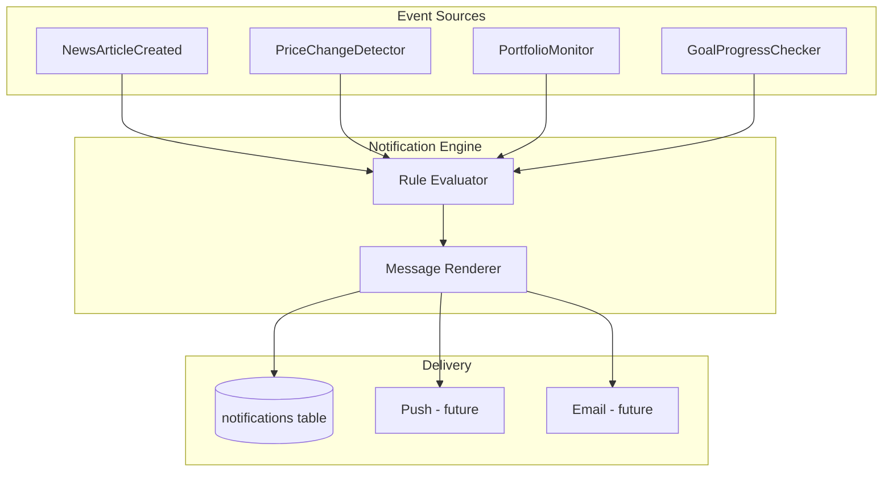

# Notification Service

Alert users about price moves, news, portfolio drawdowns, and goal milestones.

## Alert Types

| Type | Trigger | Example message |
|------|---------|-----------------|
| `PRICE_ALERT` | Asset price change exceeds threshold | "BTC dropped 5.2% in the last 24 hours" |
| `NEWS_ALERT` | New article tagged to watched/held asset | "NVDA: New article — 'NVIDIA beats earnings estimates'" |
| `PORTFOLIO_DROP` | Portfolio value drop from peak | "Your 'Retirement' portfolio is down 10.3% from its peak" |
| `GOAL_MILESTONE` | Goal progress crosses threshold | "You're 50% toward your $50,000 savings goal" |
| `SYSTEM` | Platform announcements | "Scheduled maintenance tonight at 2 AM UTC" |

## Architecture

## Data Model

### notifications (existing)

In-app inbox per user. See [ERD](../database/ERD.md).

### notification_rules (planned)

User-configurable thresholds.

| rule_type | config example |
|-----------|----------------|
| `PRICE_CHANGE_PCT` | `{"assetId": "...", "thresholdPct": 5, "windowHours": 24}` |
| `ASSET_NEWS` | `{"assetId": "..."}` |
| `PORTFOLIO_DROP_PCT` | `{"portfolioId": "...", "thresholdPct": 10}` |
| `GOAL_MILESTONE` | `{"goalId": "...", "milestones": [25, 50, 75, 100]}` |

Premium users can create custom rules. Normal users get default rules for held/watched assets.

## Default Rules (all users)

| Rule | Threshold |
|------|-----------|
| News for held assets | Any new article |
| News for watchlist assets | Any new article |
| Portfolio drop | 10% from 30-day peak (daily check) |

## Processing Schedule

| Job | Frequency | Description |
|-----|-----------|-------------|
| PriceChangeDetector | Every 5 min | Compare cached prices vs. 24h ago |
| PortfolioMonitor | Every 1 hour | Recalculate portfolio value vs. peak |
| GoalProgressChecker | On transaction / daily | Check milestone crossings |
| NewsAlertHandler | Event-driven | On `NewsArticleCreated` |

## API Endpoints

| Method | Path | Description |
|--------|------|-------------|
| GET | `/api/v1/notifications` | List user's notifications (paginated) |
| PATCH | `/api/v1/notifications/{id}/read` | Mark as read |
| POST | `/api/v1/notifications/read-all` | Mark all as read |
| GET | `/api/v1/notification-rules` | List user's rules (Premium+) |
| POST | `/api/v1/notification-rules` | Create rule (Premium+) |
| DELETE | `/api/v1/notification-rules/{id}` | Delete rule |

## Deduplication

Avoid notification spam:

- Same `PRICE_ALERT` for same asset: max 1 per 4 hours
- Same `NEWS_ALERT` for same article: exactly 1 per user
- `PORTFOLIO_DROP`: max 1 per portfolio per 24 hours

Store dedup keys in Redis: `notif:dedup:{userId}:{type}:{key}` with TTL.

## Future Channels

| Channel | MVP | v2 |
|---------|-----|-----|
| In-app | ✅ | ✅ |
| Mobile push (FCM/APNs) | ❌ | ✅ |
| Email digest | ❌ | ✅ |
