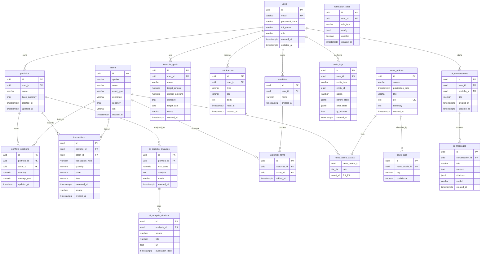

# Entity-Relationship Design

Complete database model for portfolio management, news, AI, notifications, and audit.

## Status Legend

| Symbol | Meaning |
|--------|---------|
| ✅ | Implemented in `V1__initial_schema.sql` |
| 🔜 | Planned migration (see [Planned Changes](#planned-changes-v3)) |

## ERD Diagram



## Entity Details

### users ✅

| Column | Type | Notes |
|--------|------|-------|
| id | UUID | PK, `gen_random_uuid()` |
| email | VARCHAR(320) | UNIQUE, login identifier |
| password_hash | VARCHAR(255) | bcrypt |
| full_name | VARCHAR(160) | Display name |
| role | VARCHAR(32) | `ADMIN`, `MODERATOR`, `PREMIUM`, `USER` — see [RBAC](../architecture/RBAC.md) |
| created_at | TIMESTAMPTZ | |
| updated_at | TIMESTAMPTZ | |

### portfolios ✅

One user may own multiple portfolios (e.g. "Retirement", "Crypto").

| Column | Type | Notes |
|--------|------|-------|
| id | UUID | PK |
| user_id | UUID | FK → users, CASCADE delete |
| name | VARCHAR(120) | UNIQUE per user |
| base_currency | CHAR(3) | ISO 4217 (USD, VND, …) |

### assets ✅ (Asset Master)

Canonical catalog of tradable instruments. See [ASSET_MASTER.md](ASSET_MASTER.md).

| Column | Type | Notes |
|--------|------|-------|
| id | UUID | PK |
| symbol | VARCHAR(32) | e.g. `BTC`, `AAPL`, `XAU` |
| name | VARCHAR(160) | e.g. `Bitcoin`, `Apple Inc.` |
| asset_type | VARCHAR(32) | `CRYPTO`, `STOCK`, `ETF`, `COMMODITY`, `FOREX`, `BOND` |
| exchange | VARCHAR(80) | Nullable for crypto/commodities |
| currency | CHAR(3) | Quote currency |
| isin | VARCHAR(12) | Optional for equities |

**Unique constraint:** `(symbol, exchange)`

### portfolio_positions ✅ (Holding)

Derived snapshot of current holdings per portfolio. Updated when transactions are recorded.

| Column | Type | Notes |
|--------|------|-------|
| portfolio_id | UUID | FK → portfolios |
| asset_id | UUID | FK → assets |
| quantity | NUMERIC(24,8) | Current units held |
| average_cost | NUMERIC(24,8) | Weighted average cost basis |

**Unique constraint:** `(portfolio_id, asset_id)`

> **Naming:** Domain language uses "Holding"; physical table is `portfolio_positions`.

### transactions ✅

Immutable ledger of buy/sell/dividend events.

| Column | Type | Notes |
|--------|------|-------|
| transaction_type | VARCHAR(16) | `BUY`, `SELL`, `DIVIDEND`, `TRANSFER_IN`, `TRANSFER_OUT` |
| quantity | NUMERIC(24,8) | Must be > 0 |
| price | NUMERIC(24,8) | Execution price per unit |
| fees | NUMERIC(24,8) | Default 0 |
| executed_at | TIMESTAMPTZ | Trade date |
| source | VARCHAR(120) | e.g. `manual`, `csv_import` |

Every CREATE / UPDATE / DELETE on transactions must write an `audit_logs` row.

### watchlists ✅ / watchlist_items ✅

User-curated asset lists for price and news monitoring.

### financial_goals ✅

Savings or return targets linked to a user (not necessarily a single portfolio).

| status values | `ACTIVE`, `COMPLETED`, `CANCELLED` |

### news_articles ✅

| Column | Type | Notes |
|--------|------|-------|
| source | VARCHAR(120) | Publisher name |
| publication_date | TIMESTAMPTZ | **Required** — AI KPI |
| title | VARCHAR(300) | |
| url | TEXT | UNIQUE — dedup key |
| summary | TEXT | AI-generated, ≤ 150 words |

### news_article_assets ✅

Many-to-many: which assets a news article relates to (e.g. BTC, NVDA).

### news_tags 🔜

Structured classification beyond asset linkage.

| Column | Type | Notes |
|--------|------|-------|
| news_article_id | UUID | FK → news_articles |
| tag | VARCHAR(64) | e.g. `earnings`, `regulation`, `macro` |
| confidence | NUMERIC(5,4) | 0–1 from AI tagger |

### notifications ✅

In-app alerts. See [Notification Service](../architecture/NOTIFICATION_SERVICE.md).

| type examples | `PRICE_ALERT`, `NEWS_ALERT`, `PORTFOLIO_DROP`, `GOAL_MILESTONE` |

### notification_rules 🔜

User-configurable alert thresholds.

| rule_type examples | `PRICE_CHANGE_PCT`, `ASSET_NEWS`, `PORTFOLIO_DROP_PCT` |

### ai_portfolio_analyses ✅ / ai_analysis_citations ✅

One-shot portfolio risk reports with mandatory source citations.

### ai_conversations 🔜 / ai_messages 🔜

Multi-turn AI assistant scoped to user (optionally a portfolio).

| ai_messages.role | `USER`, `ASSISTANT`, `SYSTEM` |
| ai_messages.citations | JSON array of `{source, title, url, publicationDate}` |

### audit_logs 🔜

Append-only compliance log for all financial data mutations.

| action values | `CREATE`, `UPDATE`, `DELETE` |
| entity_type examples | `TRANSACTION`, `PORTFOLIO`, `GOAL`, `WATCHLIST` |

## Indexes (current + planned)

| Index | Table | Purpose |
|-------|-------|---------|
| idx_portfolios_user_id | portfolios | List by owner |
| idx_positions_portfolio_id | portfolio_positions | Holdings lookup |
| idx_transactions_portfolio_id | transactions | History |
| idx_watchlists_user_id | watchlists | User lists |
| idx_goals_user_id | financial_goals | User goals |
| idx_news_publication_date | news_articles | Feed ordering |
| idx_notifications_user_id | notifications | Inbox |
| idx_audit_entity 🔜 | audit_logs | `(entity_type, entity_id)` |
| idx_audit_user_created 🔜 | audit_logs | `(user_id, created_at DESC)` |
| idx_assets_symbol 🔜 | assets | Search by symbol |

## Planned Changes (V3)

Migration `V3__extended_schema.sql` will add:

1. `news_tags`
2. `notification_rules`
3. `ai_conversations` + `ai_messages`
4. `audit_logs`
5. Expand `users.role` check constraint to enum values
6. Seed `assets` from [ASSET_MASTER.md](ASSET_MASTER.md)

## Relationship Summary

```
User
 ├── Portfolio ── Holding (portfolio_positions) ── Asset
 │      └── Transaction ── Asset
 ├── Watchlist ── WatchlistItem ── Asset
 ├── Goal
 ├── Notification
 ├── NotificationRule
 ├── AIConversation ── AIMessage
 └── AuditLog

Asset ── NewsArticle (via news_article_assets)
NewsArticle ── NewsTag

Portfolio ── AIPortfolioAnalysis ── AIAnalysisCitation
```
