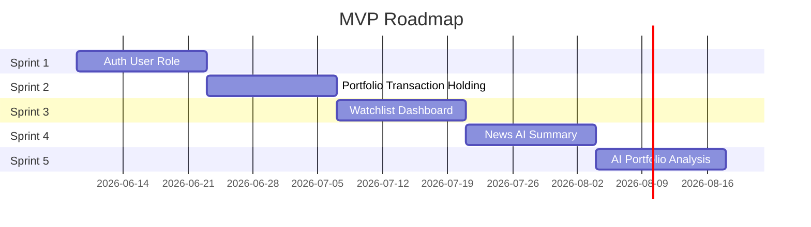

# MVP Roadmap

Five-sprint plan from foundation to AI portfolio analysis.

## Sprint Overview



---

## Sprint 1: Auth, User, Role

**Goal:** Secure identity foundation with RBAC.

| Deliverable | Details |
|-------------|---------|
| Register / Login | JWT, bcrypt, validation |
| User profile | GET `/auth/me` |
| RBAC | Roles: ADMIN, MODERATOR, PREMIUM, USER |
| Flyway V1 | users table with role column |
| Tests | Auth API tests, security unauthorized tests |
| Docs | RBAC matrix, API scope (auth section) |

**Exit criteria:** User can register, login, receive JWT; protected endpoints reject unauthenticated requests.

---

## Sprint 2: Portfolio, Transaction, Holding

**Goal:** Core portfolio management with audit trail.

| Deliverable | Details |
|-------------|---------|
| Asset Master seed | BTC, ETH, AAPL, NVDA, Gold — see [ASSET_MASTER](../database/ASSET_MASTER.md) |
| Portfolio CRUD | Create, list, delete |
| Transaction CRUD | BUY/SELL with auto holding recalc |
| Holding view | Quantity, avg cost, unrealized P&L |
| Audit log | V3 migration: log all transaction mutations |
| Frontend | Portfolio list + transaction form |
| Tests | Integration: transaction → holding update |

**Exit criteria:** User adds BTC buy transaction, sees updated holding and P&L on dashboard.

---

## Sprint 3: Watchlist, Dashboard

**Goal:** Monitoring and summary views.

| Deliverable | Details |
|-------------|---------|
| Watchlist CRUD | Add/remove assets |
| Dashboard | Portfolio value, top movers, allocation chart |
| Price integration | Redis-cached prices from external API |
| Notification schema | notifications + notification_rules tables |
| Frontend | Dashboard page, watchlist page |
| Tests | Watchlist API tests, dashboard component tests |

**Exit criteria:** User creates watchlist with NVDA, sees it on dashboard alongside portfolio summary.

---

## Sprint 4: News, AI Summary

**Goal:** Automated news pipeline with sourced summaries.

| Deliverable | Details |
|-------------|---------|
| RSS Fetcher | Scheduled ingestion |
| AI Summarizer | ≤ 150 words, source + date required |
| News Tagger | Asset + topic tagging |
| News API | GET `/news` with asset filter |
| News frontend | Feed page with source links |
| AI KPI validation | Automated quality gate |
| Tests | Pipeline integration test, KPI unit tests |

**Exit criteria:** System auto-ingests news; user filters BTC news and sees AI summary with source and date.

See [News + AI Pipeline](../architecture/NEWS_AI_PIPELINE.md).

---

## Sprint 5: AI Portfolio Analysis

**Goal:** AI-powered portfolio insights with citations.

| Deliverable | Details |
|-------------|---------|
| Analysis endpoint | POST `/portfolios/{id}/analysis` |
| Citation storage | ai_portfolio_analyses + ai_analysis_citations |
| Risk score | 0–100 computed by AI |
| Analysis history | GET past analyses |
| Frontend | Analysis panel on portfolio page |
| Disclaimer | "Not financial advice" in UI |
| Tests | Analysis API test, citation presence validation |

**Exit criteria:** User requests analysis, receives risk score + narrative + at least one citation.

---

## Post-MVP Backlog

| Sprint | Features |
|--------|----------|
| Sprint 6 | Notification delivery (price alerts, news alerts) |
| Sprint 7 | AI multi-turn chat (Premium) |
| Sprint 8 | Financial goals + milestone notifications |
| Sprint 9 | CSV import, mobile app parity |
| Sprint 10 | Admin panel, moderator tools, audit log UI |

---

## Dependencies

```
Sprint 1 (Auth)
    └── Sprint 2 (Portfolio) — requires authenticated user
            └── Sprint 3 (Dashboard) — requires holdings data
                    └── Sprint 4 (News) — tags need Asset Master
                            └── Sprint 5 (AI Analysis) — uses holdings + news context
```

## Risk Register

| Risk | Mitigation |
|------|------------|
| AI cost overrun | Rate limit, batch size cap, gpt-4o-mini default |
| RSS source changes | Configurable feed list, monitoring |
| Price API limits | Redis cache, fallback provider |
| Scope creep | MoSCoW in [User Stories](../product/USER_STORIES.md) |
